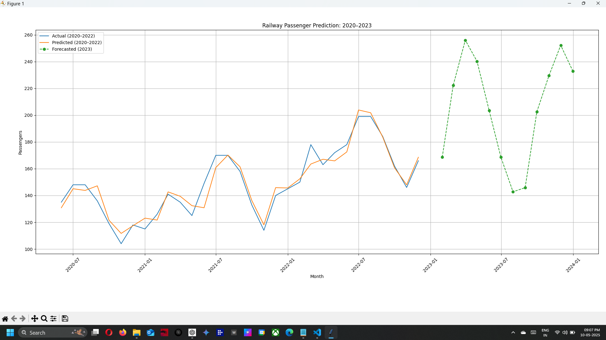

---

# Railway Passengers Volume Prediction Using LSTM (PyTorch)

This project utilizes an **LSTM (Long Short-Term Memory)** neural network built with **PyTorch** to forecast **monthly railway passenger volumes**. The model is trained on data spanning from **2020 to 2022** and forecasts volumes for **2023**, capturing seasonal and festival-related trends.

---

## 🚀 Features

* Time-series forecasting using **LSTM**
* Lightweight **PyTorch** implementation
* Predicts future passenger volumes for 2023
* Data pre-processing, model training, and visualizations included
* Graphs illustrating actual vs. predicted values

---

## 📊 Project Overview

The model is trained on monthly railway passenger counts from **Jan 2020 to Dec 2022**. After learning seasonal and event-based patterns, it forecasts monthly volumes for **2023**, aiming to reflect real-world fluctuations like festivals and holidays.

---

## 📁 Folder Structure

```
railway_passenger_prediction/
│
├── data/
│   └── railway_passengers.csv         # 🚆 Historical passenger data (2020–2022)
├── images/
│   └── prediction_output.png          # 📷 Output visualization
├── utils/
│   └── data_preparation.py            # 📊 Data loading and preprocessing logic
├── model/
│   └── lstm_model.py                  # 🧠 LSTM model architecture
├── train.py                           # 🔁 Model training script
├── predict.py                         # 📈 Prediction and visualization
├── requirements.txt                   # 📦 Python dependencies
└── README.md                          # 📄 Project documentation
```

---

## 📦 Requirements

* **Python 3.x**
* Libraries:

  * `torch`
  * `pandas`
  * `matplotlib`
  * `scikit-learn`

Install the dependencies:

```bash
pip install -r requirements.txt
```

---

## 🧪 How to Run the Project

### 1️⃣ Clone the Repository

```bash
git clone https://github.com/venkatesh1715/railway-passenger-prediction.git
cd railway-passenger-prediction
```

### 2️⃣ Install Dependencies

```bash
pip install -r requirements.txt
```

### 3️⃣ Train the Model

```bash
python train.py
```

> This trains the LSTM model and saves the weights to `lstm_model.pth`.

### 4️⃣ Predict for 2023

```bash
python predict.py
```

> Generates predictions for Jan–Dec 2023, plots the results, and saves the graph to `images/prediction_output.png`.

### 5️⃣ View the Output

Open the generated plot from:

```
images/prediction_output.png
```

### 6️⃣ Customize the Dataset

Update the CSV in `data/railway_passengers.csv` to use your own time-series dataset.

---

## 📈 Forecast Output

Below is a sample of the predicted monthly railway passenger volumes for 2023:



---

## 🧠 Model Details

This project leverages **LSTM**, a type of **Recurrent Neural Network (RNN)** that captures temporal patterns and long-term dependencies—ideal for time-series forecasting.

### Core Concepts:

* **Time-Series Forecasting**: Predict future values from past sequential data
* **LSTM (Long Short-Term Memory)**: Advanced RNN for long-range dependency learning

---

## 💼 Potential Applications

* Transport system forecasting and planning
* Demand prediction in public transport
* Tourism traffic analytics
* Ticketing system optimization

---

## 📄 License

This project is licensed under the **MIT License**. See the [LICENSE](LICENSE) file for full terms.

---

## 🙏 Acknowledgments

* Thanks to the **PyTorch** community for building a robust ML framework.
* Gratitude to open-source contributors for sharing time-series modeling resources and inspiration.

---
