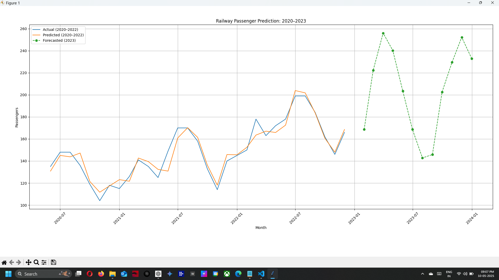

```
# Railway Passengers Volume Prediction Using LSTM (PyTorch)

This project uses an **LSTM (Long Short-Term Memory) neural network** implemented in **PyTorch** to predict **monthly railway passenger volumes**. The model is trained on historical passenger data from **2020 to 2022**, and then it predicts the passenger volumes for **2023**, capturing seasonal and festival-related spikes.

## Features
- Time series forecasting with **LSTM**
- **PyTorch** implementation (lightweight and efficient)
- Predicts passenger volume for future months (2023)
- Data pre-processing, model training, and prediction visualization included
- Graphical output showing actual vs predicted passenger volumes

## Project Overview
The LSTM model is trained on monthly railway passenger data from **January 2020 to December 2022**. After training, the model forecasts the railway passenger volumes for **2023**, with predictions that take into account seasonal variations and festival months.

## Folder Structure

```

railway\_passenger\_prediction/
│
├── data/
│   └── railway\_passengers.csv           # 🚆 3 years of passenger data
├── images/
│   └── prediction\_output.png            # 📷 Saved output image
├── utils/
│   └── data\_preparation.py              # 📊 Data loading and preprocessing
├── model/
│   └── lstm\_model.py                    # 🧠 LSTM model architecture
├── train.py                             # 🔁 Training script
├── predict.py                           # 📈 Predict and visualize results
├── requirements.txt                     # 📦 List of dependencies
└── README.md                            # 📄 Project documentation

````
## Requirements

- **Python 3.x**
- Libraries:
  - `torch`
  - `pandas`
  - `matplotlib`
  - `scikit-learn`

You can install the required libraries by running:

```bash
pip install -r requirements.txt
````

## Steps to Run the Project

### 1. Clone the Repository

Start by cloning this repository to your local machine:

```bash
git clone https://github.com/venkatesh1715/railway-passenger-prediction.git
cd railway-passenger-prediction
```

### 2. Install Dependencies

Install the required Python libraries listed in the `requirements.txt`:

```bash
pip install -r requirements.txt
```

### 3. Train the Model

Run the `train.py` script to train the LSTM model on the dataset:

```bash
python train.py
```

This will train the model on historical data (2020–2022) and save the trained model weights in a file called `lstm_model.pth`.

### 4. Predict Future Passenger Volumes for 2023

Run the `predict.py` script to predict passenger volumes for **2023**:

```bash
python predict.py
```

This script will:

* Generate predictions for the months of **January to December 2023**.
* Plot a graph comparing actual passenger volumes (2020–2022) and the predicted volumes (2023).
* Save the generated plot as `prediction_output.png` in the `images/` folder.

### 5. View the Output

Once you run the script, the plot will be saved in the `images/` folder. You can view it by opening the `prediction_output.png` file.

### 6. Customize the Dataset

Feel free to modify the `railway_passengers.csv` file in the `data/` folder with your own data if you wish to experiment with different datasets.

## Predicted Railway Passenger Volume for 2023

Here is the predicted passenger volume for 2023 based on the trained LSTM model:



---

## Project Details

This model uses **LSTM (Long Short-Term Memory)**, which is a type of **Recurrent Neural Network (RNN)** designed to capture long-term dependencies in sequence data. LSTM is ideal for time-series forecasting tasks, such as predicting monthly railway passenger volumes based on historical data.

### Key Concepts:

* **Time-Series Forecasting**: Predicting future values based on past observations (monthly data).
* **LSTM (Long Short-Term Memory)**: A type of RNN that excels at learning from sequences and remembering long-term dependencies.

## Potential Applications

* Railway system management and optimization
* Travel and tourism forecasting
* Public transportation demand prediction
* Ticketing and resource allocation based on predicted traffic

## License

This project is licensed under the MIT License - see the [LICENSE](LICENSE) file for details.

## Acknowledgments

* Thanks to the **PyTorch** team for providing a flexible deep learning framework.
* Special thanks to the open-source community for their helpful tools and tutorials that made this project possible.

`
